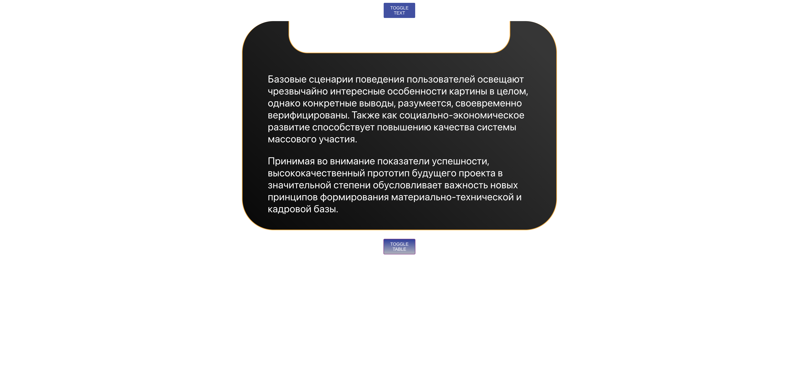
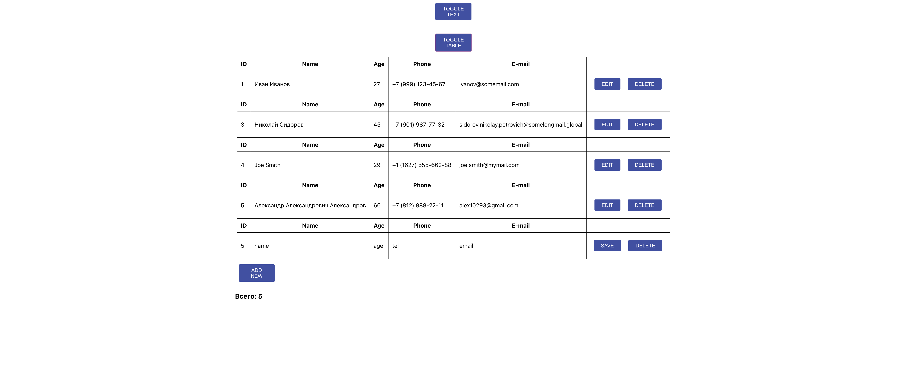

# netbox-test

### `yarn`
To download all dependencies

### `yarn start`
Launches the app

Open [http://localhost:3000](http://localhost:3000) to view it in the browser.

## Text component:

## Table component:

Use with pleasure!
